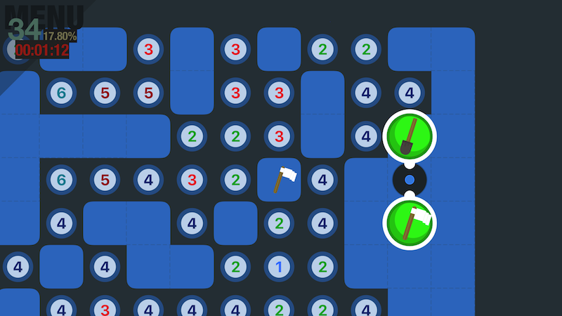

# Minesweeper
Minesweeper clone created for an iOS course as a training project.

## Built With
* Xcode version ~~8~~ / 9
* Swift ~~3~~ 4

## Status
* Minefield
  - Fully customizable, though only map size varies
  - Randomized using Perlin Noise - [GitHub/Perlin iOS](https://github.com/czgarrett/perlin-ios)
  - All graphics generated using Core Graphics
  - Minefield implemented using UI components intead of SpriteKit
* Menu system
  - Dynamic and animated
  - Mostly programmatically generated
* High scores and statistics
  
### Future
- Testing scaling and other functionality with an actual device
- More fireworks for the game over event
- Smoother transition for lesser devices when starting a new game
- There's some spaghetti
